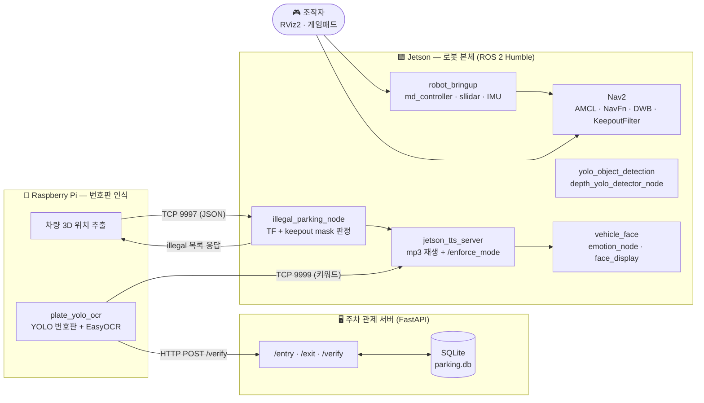
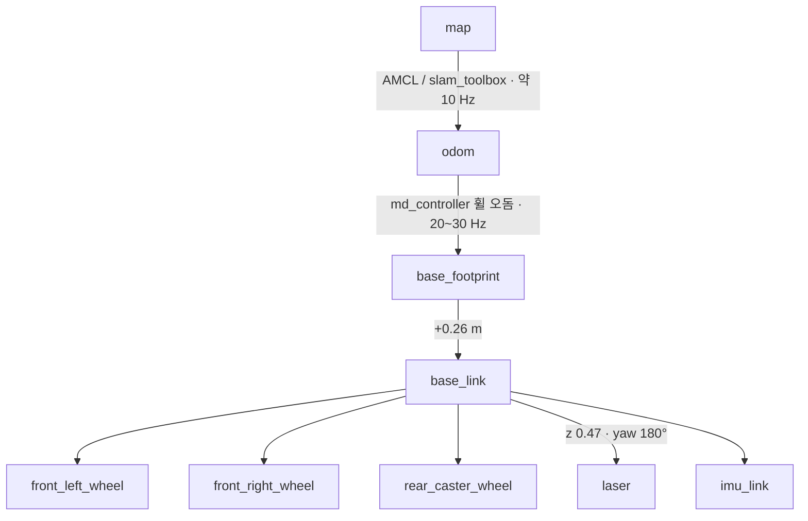
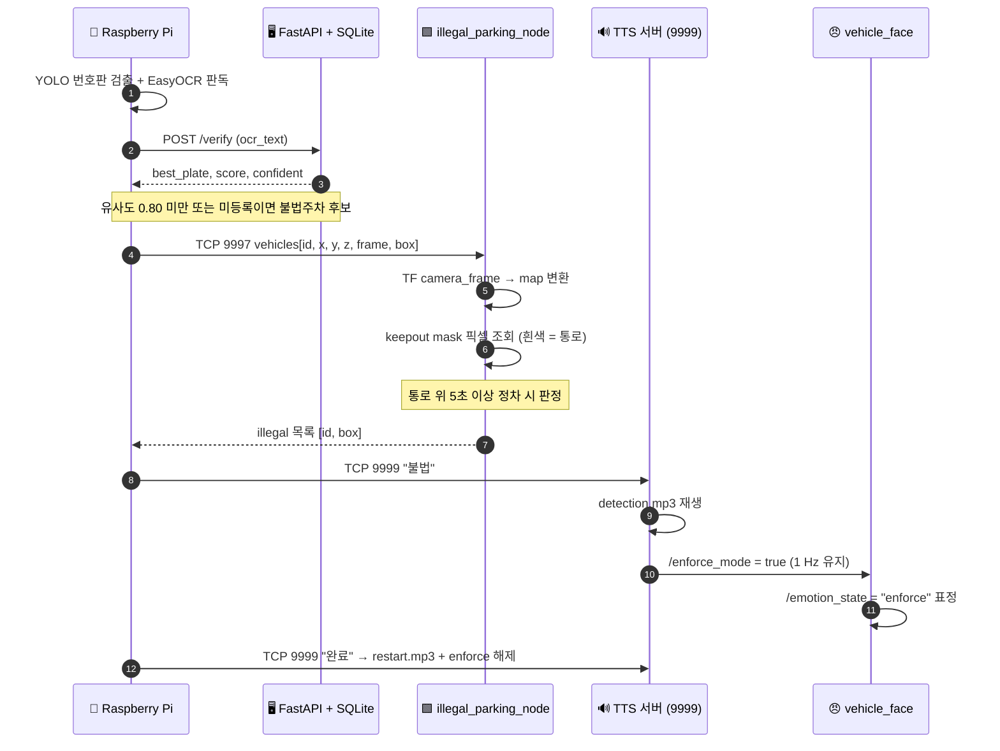

<div align="center">

# 🚗 OMZ — 주차장 순찰 자율주행 로봇

**ROS 2 Humble 기반 주차장 순찰 로봇 워크스페이스**

SLAM으로 만든 지도 위를 Nav2로 순찰하며, 카메라로 차량·보행자를 인식하고
번호판 DB와 대조해 **불법주차를 판별**하고 **음성·표정으로 경고**합니다.

[](https://docs.ros.org/en/humble/)
[](https://navigation.ros.org/)
[](https://github.com/SteveMacenski/slam_toolbox)
[](https://docs.ultralytics.com/)
[](https://developer.nvidia.com/embedded-computing)
[](#-라이선스)

</div>

---

## 📑 목차

- [프로젝트 개요](#-프로젝트-개요)
- [시스템 아키텍처](#-시스템-아키텍처)
- [하드웨어 구성](#-하드웨어-구성)
- [TF 트리 & 좌표계](#-tf-트리--좌표계)
- [저장소 구조](#-저장소-구조)
- [패키지 카탈로그](#-패키지-카탈로그)
- [빠른 시작](#-빠른-시작)
- [실행 시나리오](#-실행-시나리오)
- [불법주차 단속 파이프라인](#-불법주차-단속-파이프라인)
- [주요 토픽 인터페이스](#-주요-토픽-인터페이스)
- [Nav2 튜닝 요약](#️-nav2-튜닝-요약)
- [지도 & Keepout 마스크](#️-지도--keepout-마스크)
- [트러블슈팅](#-트러블슈팅)
- [알려진 제약](#️-알려진-제약)
- [라이선스](#-라이선스)

---

## 🎯 프로젝트 개요

`omz_ws`는 **주차장 순찰 로봇 한 대를 통째로 굴리기 위한 ROS 2 워크스페이스**입니다.
자체 개발 패키지 5종과 하드웨어 드라이버(모터·라이다·IMU·뎁스 카메라),
그리고 로봇 외부에서 도는 번호판 인식 서버·TTS 서버까지 한 저장소에 모여 있습니다.

로봇이 하는 일은 크게 네 가지입니다.

| # | 기능 | 구현 |
|---|------|------|
| 1 | **지도 작성** | `slam_toolbox` (async, mapping 모드) → PGM/YAML 저장 |
| 2 | **자율 순찰** | Nav2 (AMCL + NavFn + DWB) + **KeepoutFilter**로 주행 가능 통로만 이동 |
| 3 | **객체 인식** | Orbbec 뎁스 카메라 + YOLOv8n → 사람/차량 검출 + **거리(m) 추정** + RViz 3D 마커 |
| 4 | **불법주차 단속** | 번호판 OCR ↔ 주차 DB 대조 + 통로 위 5초 이상 정차 판정 → 음성 경고 + 표정 변경 |

> 💡 **저속 실차 기준**으로 튜닝되어 있습니다. 실제 주행 속도는 **0.03 ~ 0.05 m/s** 수준이며,
> Nav2 파라미터·DWB 예측 구간·AMCL 갱신 주기가 모두 이 속도에 맞춰져 있습니다.

---

## 🏗 시스템 아키텍처

세 대의 컴퓨터가 역할을 나눠 갖습니다.



| 노드 | 역할 | 통신 |
|------|------|------|
| **Jetson** | ROS 2 전체 스택(주행·SLAM·Nav2·YOLO·표정·TTS) | DDS, TCP 9997 / 9999 서버 |
| **Raspberry Pi** | 번호판 YOLO + EasyOCR, 차량 3D 위치 송신 | HTTP → FastAPI, TCP → Jetson |
| **관제 PC/서버** | 입·출차 등록 DB, 번호판 유사도 검증 API | FastAPI + SQLite |

---

## 🔩 하드웨어 구성

| 구분 | 장비 | 인터페이스 | 관련 패키지 |
|------|------|-----------|-------------|
| 구동부 | **MDROBOT 듀얼채널 모터 드라이버** (md200t / md400t) | RS485 / USB, 19200 bps | `md_controller` |
| 바퀴 | 인휠 모터 ×2 (반지름 65 mm, 축간 288 mm) + 후방 캐스터 | — | URDF `two_wheel_caster_robot` |
| LiDAR | **Slamtec RPLIDAR C1** | USB CP2102N, 460800 bps | `sllidar_ros2` |
| IMU | **WIT WT901C** | USB, 9600 bps (기본 비활성) | `wit_imu_driver` |
| 카메라 | **Orbbec Astra** 뎁스 카메라 (640×480 @ 10 fps) | USB, OrbbecSDK / OpenNI | `orbbec_camera` |
| 디스플레이 | 차량 전면 모니터 (도트 매트릭스 표정) | HDMI + pygame | `vehicle_face` |
| 오디오 | USB 스피커 (`mpg123` 재생) | ALSA / PulseAudio | `jetson_tts_server.py` |
| 조종기 | XInput 게임패드 (`sudo modprobe xpad`) | USB | `joystick_teleop` |

**로봇 치수** — 차체 `0.56 × 0.50 × 0.26 m`, 지면~`base_link` 0.26 m, LiDAR 높이 0.47 m,
Nav2 footprint `[[0.28, 0.25], [0.28, -0.25], [-0.28, -0.25], [-0.28, 0.25]]`

---

## 🧭 TF 트리 & 좌표계



- 좌표 규약: `x+` 전방, `y+` 좌측, `z+` 상방
- RPLIDAR C1은 스캔 0도가 차체 전방의 **반대**를 향하므로 URDF에서 `yaw = π` 회전을 적용했습니다.
- `odom → base_footprint`는 **휠 오돔 단독**으로 발행합니다 (`odom_encoder_ppr:=55`).
  `config/ekf.yaml`에 robot_localization 설정이 있지만 **현재 실행하지 않습니다.**

---

## 📁 저장소 구조

```text
omz_ws/
├── src/                              # ROS 2 패키지
│   ├── my_robot_description/         # ⭐ URDF · launch · Nav2/SLAM 설정 · 지도 · 유틸 스크립트
│   ├── yolo_object_detection/        # ⭐ YOLOv8 + 뎁스 거리 추정 노드
│   ├── vehicle_face/                 # ⭐ 차량 표정 디스플레이 (pygame)
│   ├── joystick_teleop/              # ⭐ 게임패드 수동 조종 (데드맨 스위치)
│   ├── illegal_parking_detector/     # ⭐ 불법주차 판정 노드 ROS 2 래퍼
│   ├── md_motor_driver_ros2/         # MD 모터 드라이버 (md_controller · md_teleop · serial)
│   ├── sllidar_ros2/                 # RPLIDAR 드라이버
│   ├── ros_wit_imu_node/             # WIT IMU 드라이버
│   ├── OrbbecSDK_ROS2/               # Orbbec 카메라 드라이버
│   └── turtlebot3*/ · DynamixelSDK/  # teleop_keyboard 등 참고용 벤더 패키지
├── apps/
│   └── car_number_db/                # 🅿️ FastAPI 주차 관제 서버 + 입·출차 카메라 클라이언트
├── external/
│   ├── car_license_plate/            # 라즈베리파이 측 번호판 인식 · 불법주차 판정 노드 원본
│   ├── depth_camera/                 # jetson_tts_server.py · 경고음 mp3 · Astra SDK
│   └── map_keepoutfilter/            # Keepout 마스크 생성 결과물 및 적용 가이드
├── tools/
│   ├── omz_new_launch.sh             # bringup → 토픽/TF 대기 → Nav2 순차 기동 (`new` 별칭)
│   ├── lidar_scan_viewer.py          # 브라우저로 LaserScan 실시간 확인
│   ├── yaw_compare.py                # 휠 오돔 yaw vs IMU yaw 비교
│   └── run_rviz_lidar.sh             # Jetson 데스크톱에서 RViz 띄우기
├── docs/                             # 지도 원본 · TF 프레임 그래프 · MD 드라이버 매뉴얼
└── robot_run_commands.md             # 로봇에서 자주 쓰는 명령 치트시트
```

> ⭐ = 이 프로젝트에서 직접 작성한 패키지

---

## 📦 패키지 카탈로그

### 자체 개발 패키지

<details open>
<summary><b>my_robot_description</b> — 로봇 기술·주행 스택의 중심</summary>

<br/>

| 구성 | 내용 |
|------|------|
| `urdf/two_wheel_caster_robot.urdf` | 차동 구동 2륜 + 캐스터 모델, LiDAR/IMU 마운트 |
| `launch/robot_bringup.launch.py` | 모터·LiDAR·IMU·카메라를 인자로 on/off 하는 통합 bringup |
| `launch/nav2_slam.launch.py` | TF 준비 대기(기본 10초) 후 slam_toolbox 기동 |
| `launch/nav2_navigation.launch.py` | KeepoutFilter 3종 + Nav2 bringup + RViz + 웨이포인트 노드 |
| `launch/save_current_map.launch.py` | 기존 지도를 `maps/old/`로 타임스탬프 백업 후 새로 저장 |
| `config/nav2_params.yaml` | 저속 실차 전용 Nav2 튜닝 (631줄, 한글 주석) |
| `behavior_trees/*.xml` | **spin·backup 복구 동작을 제거한** 커스텀 BT |
| `scripts/rviz_waypoint_goal.py` | RViz `Publish Point` 클릭을 웨이포인트로 모아 경로 미리보기 후 전송 |
| `scripts/q_emergency_stop.py` | `q` 키로 `/cmd_vel` 0을 연속 발행하는 비상 정지 |
| `scripts/scan_visual_filter.py` | 최대거리 근처 노이즈를 제거한 `/scan_visual` 발행 |
| `scripts/odom_drive_test.py` | 휠 오돔 직진 1 m 캘리브레이션 테스트 |
| `scripts/paint_keepout_rect.py` | Keepout 마스크에 사각 영역을 직접 칠하는 편집 도구 |

</details>

<details>
<summary><b>yolo_object_detection</b> — 사람/차량 검출 + 거리 추정</summary>

<br/>

- `yolo_detector_node` — RGB 이미지 → `/yolo/detections`(JSON), `/yolo/image`
- `depth_yolo_detector_node` — 박스 중심 주변 **7×7 뎁스 윈도우**를 샘플링해 `depth_m`을 붙이고,
  카메라 내부 파라미터로 3D 좌표를 복원해 `/yolo_depth/markers`(RViz `MarkerArray`)로 발행
- 검출 클래스: `person`(COCO 0), `vehicle`(car·motorcycle·bus·truck) → `category` 필드로 분류
- 런치 4종: `yolo_detector` / `orbbec_yolo` / `orbbec_depth_yolo` / `astra_openni_depth_yolo`
- 헤드리스 로봇에서는 `show_preview:=false`

</details>

<details>
<summary><b>vehicle_face</b> — 차량 감정 표현 디스플레이</summary>

<br/>

- `emotion_node` — `/cmd_vel` · `/scan` · `/enforce_mode`를 종합해 약 3 Hz로 `/emotion_state` 발행
  - 우선순위 `enforce` → `obstacle` → `driving` → `stop`
  - 전방 60° 최소거리 **1.0 m 진입 / 2.2 m 해제** 히스테리시스로 표정 깜빡임 방지
  - 단속(`enforce`) 상태는 10초 뒤 자동 해제
- `face_display` — pygame 도트 매트릭스 표정 창 (키 `1~4` 수동 전환, `ESC` 종료)

</details>

<details>
<summary><b>joystick_teleop</b> — 안전 장치가 붙은 수동 조종</summary>

<br/>

- **데드맨 버튼(RB)을 누르고 있는 동안만** `/cmd_vel` 발행, 떼면 즉시 0 발행
- `B` 비상 정지 · `Y`/`A`로 전진/후진 속도를 0.01 m/s 단위로 **각각** 조정
- 상한 `max_lin_vel 0.09 m/s`, `max_ang_vel 0.12 rad/s`

</details>

<details>
<summary><b>illegal_parking_detector</b> — 불법주차 판정 노드 래퍼</summary>

<br/>

`external/car_license_plate/illegal_parking_node.py`를 `importlib`로 로드해
ROS 2 실행 파일로 감싼 얇은 패키지입니다.

```bash
ros2 launch illegal_parking_detector illegal_parking.launch.py
```

</details>

### 주차 관제 서버 — `apps/car_number_db`

| 엔드포인트 | 설명 |
|-----------|------|
| `POST /entry` | 입차 등록 (`plate` upsert → `status='parked'`) |
| `POST /exit/{plate}` | 출차 처리 (`status='exited'`) |
| `POST /verify` | OCR 문자열과 주차 중인 번호판을 유사도 비교, **임계값 0.80** |
| `GET /docs` | FastAPI 자동 문서 |

`matcher.py`가 최대 5개 후보와 점수를 돌려주고, 모든 판독 이력은 `plate_read_log` 테이블에 남습니다.

### 외부 · 벤더 패키지

| 패키지 | 출처 |
|--------|------|
| `md_motor_driver_ros2` | [Lee-seokgwon/md_motor_driver_ros2](https://github.com/Lee-seokgwon/md_motor_driver_ros2) |
| `sllidar_ros2` | [Slamtec/sllidar_ros2](https://github.com/Slamtec/sllidar_ros2) |
| `ros_wit_imu_node` | [Ericsii/ros_wit_imu_node](https://github.com/Ericsii/ros_wit_imu_node) |
| `OrbbecSDK_ROS2` | [orbbec/OrbbecSDK_ROS2](https://github.com/orbbec/OrbbecSDK_ROS2) (`v2-main`) |
| `turtlebot3`, `turtlebot3_msgs`, `turtlebot3_simulations`, `DynamixelSDK` | ROBOTIS (teleop·시뮬 참고용) |

---

## 🚀 빠른 시작

### 1. 요구 사항

Ubuntu 22.04 + **ROS 2 Humble**

```bash
sudo apt install ros-humble-navigation2 ros-humble-nav2-bringup \
                 ros-humble-slam-toolbox ros-humble-robot-localization \
                 ros-humble-joy ros-humble-rviz2 mpg123
python3 -m pip install ultralytics pygame
```

### 2. 클론 & 빌드

```bash
git clone https://github.com/OMZcapstone/omz_ws.git ~/omz_ws
cd ~/omz_ws
source /opt/ros/humble/setup.bash
colcon build --symlink-install
source install/setup.bash
```

### 3. 하드웨어 준비

```bash
sudo modprobe xpad            # 게임패드
ls -l /dev/serial/by-id/      # 모터·LiDAR·IMU 포트 확인
```

> ⚠️ `robot_bringup.launch.py`의 시리얼 포트 기본값은 **개발용 Jetson의 `by-path` 경로**로 고정되어 있습니다.
> 다른 기기에서는 `motor_port:=`, `lidar_port:=`, `imu_port:=` 인자로 덮어써야 합니다.
> YOLO 가중치(`yolov8n.pt`)와 번호판 모델(`best.pt`)은 `.gitignore` 대상이라 **별도로 배치**해야 합니다.

---

## 🎬 실행 시나리오

### ① 로봇 기동

```bash
ros2 launch my_robot_description robot_bringup.launch.py
```

| 인자 | 기본값 | 설명 |
|------|--------|------|
| `use_motor` / `use_lidar` | `true` | 모터·LiDAR 구동 |
| `use_imu` / `use_camera` | `false` | IMU·Orbbec 카메라 (필요 시 활성화) |
| `odom_encoder_ppr` | `55` | **휠 오돔 보정 핵심 값** |
| `motor_cmd_scale` | `10.0` | 바퀴 RPM 명령 최종 배율 |
| `left_motor_cmd_scale` / `right_motor_cmd_scale` | `1.00` | 직진 시 좌·우 쏠림 트림 |
| `angular_cmd_scale` | `0.6` | 회전 명령 감쇠 |
| `publish_odom_tf` | `true` | `odom → base_footprint` TF 발행 |

### ② bringup + Nav2 한 번에 (권장)

`tools/omz_new_launch.sh`는 기존 프로세스를 정리하고 → bringup 기동 →
`/odom`·`/scan`·`odom→base_footprint` TF가 올라올 때까지 대기한 뒤 → Nav2를 띄웁니다.

```bash
new            # start (= tools/omz_new_launch.sh start)
newstatus      # 프로세스 + 노드 목록
newlogs        # 로그 디렉터리 경로 (~/.ros/omz_new)
newstop        # 전체 정지
```

### ③ SLAM으로 지도 만들기 → 저장

```bash
ros2 launch my_robot_description nav2_slam.launch.py     # 기동 후 수동 주행으로 맵 작성
ros2 launch my_robot_description save_current_map.launch.py
# → src/my_robot_description/maps/current/omz_map.{yaml,pgm}
#   기존 지도는 maps/old/ 로 타임스탬프 백업
```

### ④ 자율주행

```bash
ros2 launch my_robot_description nav2_navigation.launch.py
```

RViz에서 **2D Pose Estimate**로 초기 위치를 잡은 뒤,
`Publish Point`를 여러 번 찍어 웨이포인트를 쌓고 **2D Goal Pose**로 경로를 전송합니다.
`rviz_waypoint_goal` 노드가 경유 경로를 미리 그려 보여줍니다.

### ⑤ 수동 조종

```bash
ros2 launch joystick_teleop joystick_teleop.launch.py    # 게임패드 (RB 유지)
ros2 run turtlebot3_teleop teleop_keyboard               # 키보드
ros2 run my_robot_description q_emergency_stop           # q = 비상 정지
```

### ⑥ 카메라 + YOLO

```bash
ros2 launch yolo_object_detection orbbec_yolo.launch.py                     # RGB
ros2 launch yolo_object_detection orbbec_depth_yolo.launch.py               # RGB + 거리
ros2 launch yolo_object_detection orbbec_depth_yolo.launch.py show_preview:=false
```

### ⑦ 표정 & 음성

```bash
face                                      # 표정창 + 자동 표정 노드 (셸 별칭)
ros2 run vehicle_face face_display        # 모니터가 연결된 터미널에서
ros2 run vehicle_face emotion_node
ros2 topic pub /emotion_state std_msgs/String "data: driving"   # 수동 테스트

say                                       # USB 스피커 지정 + TTS 서버 (셸 별칭)
python3 ~/omz_ws/external/depth_camera/jetson_tts_server.py
```

### ⑧ 주차 관제 서버

```bash
cd apps/car_number_db
pip install fastapi uvicorn opencv-python easyocr requests
uvicorn app:app --reload        # http://127.0.0.1:8000/docs
python camera_entry.py          # 입차 게이트 카메라
python camera_exit.py           # 출차 게이트 카메라
```

---

## 🚨 불법주차 단속 파이프라인



| 수신 키워드 | 재생 음원 | 효과 |
|------------|----------|------|
| `사람` / `차량` / `물체` | `warning.mp3` | 근접 경고 (단속 중에는 생략) |
| `불법` | `detection.mp3` | `/enforce_mode = true` |
| `완료` | `restart.mp3` | `/enforce_mode = false` |

---

## 🔌 주요 토픽 인터페이스

| 토픽 | 타입 | 발행 | 구독 |
|------|------|------|------|
| `/cmd_vel` | `geometry_msgs/Twist` | Nav2 · teleop · 비상정지 | `md_controller`, `emotion_node` |
| `/odom` | `nav_msgs/Odometry` | `md_controller` | Nav2, `yaw_compare` |
| `/joint_states` | `sensor_msgs/JointState` | `md_controller` | `robot_state_publisher` |
| `/md/motor_feedback` | `std_msgs/Int32MultiArray` | `md_controller` | 진단용 |
| `/scan` | `sensor_msgs/LaserScan` | `sllidar_node` | Nav2, slam_toolbox, `emotion_node` |
| `/scan_visual` | `sensor_msgs/LaserScan` | `scan_visual_filter` | RViz 시각화 |
| `/camera/color/image_raw`, `/camera/depth/image_raw` | `sensor_msgs/Image` | `orbbec_camera` | YOLO 노드 |
| `/yolo/detections`, `/yolo_depth/detections` | `std_msgs/String` (JSON) | YOLO 노드 | 외부 소비자 |
| `/yolo_depth/markers` | `visualization_msgs/MarkerArray` | `depth_yolo_detector_node` | RViz |
| `/clicked_point` | `geometry_msgs/PointStamped` | RViz | `rviz_waypoint_goal` |
| `/waypoint_global_plan`, `/waypoint_markers` | `nav_msgs/Path`, `MarkerArray` | `rviz_waypoint_goal` | RViz |
| `/emotion_state` | `std_msgs/String` | `emotion_node` | `face_display` |
| `/enforce_mode` | `std_msgs/Bool` | TTS 서버 | `emotion_node` |
| `/costmap_filter_info`, `/keepout_filter_mask` | Nav2 필터 | map_server 2종 | global · local costmap |

**사용 액션** — `/navigate_to_pose`, `/navigate_through_poses`, `/compute_path_to_pose`, `/compute_path_through_poses`

---

## ⚙️ Nav2 튜닝 요약

`config/nav2_params.yaml`은 저속 실차에서 "찔끔찔끔 움직임"과 "우측 쏠림"을 잡는 데 초점이 맞춰져 있습니다.

| 항목 | 값 | 의도 |
|------|-----|------|
| Planner | `NavfnPlanner` (GridBased), 0.5 Hz 재계획 | 저속에서 경로가 흔들리지 않도록 |
| Controller | `DWBLocalPlanner` @ 10 Hz | 제어 갱신 끊김 방지 |
| `max_vel_x` / `max_speed_xy` | **0.05 m/s** | AMCL 정합 유지 |
| `max_vel_theta` | 0.15 rad/s | 경로 방향 추종 여유 확보 |
| velocity_smoother | `[0.06, 0.0, 0.08]`, 최소 x = 0 | 자동주행 중 후진 명령 차단 |
| Costmap 해상도 / inflation | 0.05 m / 0.30 m | footprint 내접원보다 크게 |
| Localization | AMCL `DifferentialMotionModel` | 차동 구동 모델 |
| Behavior Tree | `navigate_*_no_spin.xml` | **spin·backup 복구 제거**, 실패 시 로컬 코스트맵 클리어 후 2초 대기 ×2 |
| Costmap filter | `KeepoutFilter` (global + local) | 마스크 밖 영역 진입 금지 |

---

## 🗺️ 지도 & Keepout 마스크

| 파일 | 용도 |
|------|------|
| `maps/current/om_map_original_cleaned.{yaml,pgm}` | **Nav2 기본 지도** (resolution 0.05, origin `-22.6, -8.12`) |
| `maps/current/keepout_mask_full_centerline_bias.{yaml,pgm}` | 주행 허용 통로 마스크 (**흰색 = 통로**) |
| `maps/current/omz_map.*` | slam_toolbox 최신 저장본 |
| `maps/old/` | 타임스탬프 백업 |
| `external/map_keepoutfilter/` | 마스크 생성 결과물 + `nav2_params` 병합 가이드 |

같은 마스크를 **불법주차 판정에도 재사용**합니다. `illegal_parking_node`는 차량의 map 좌표를
픽셀로 환산해 마스크가 흰색(통로)이면 "통로 점유"로 보고, 5초 이상 유지되면 단속으로 판정합니다.

```bash
ros2 run my_robot_description paint_keepout_rect   # 마스크 사각 영역 편집
```

---

## 🔧 트러블슈팅

<details>
<summary><b>로봇이 직진하지 않고 한쪽으로 쏠립니다</b></summary>

<br/>

`left_motor_cmd_scale` / `right_motor_cmd_scale`로 트림합니다.
오른쪽으로 쏠리면 `left_motor_cmd_scale`을 내리세요.

```bash
ros2 launch my_robot_description robot_bringup.launch.py left_motor_cmd_scale:=0.97
```

</details>

<details>
<summary><b>주행 거리가 실제와 다릅니다</b></summary>

<br/>

`odom_encoder_ppr`를 조정한 뒤 1 m 직진 테스트로 검증합니다.

```bash
ros2 run my_robot_description odom_drive_test --ros-args \
  -p speed:=0.05 -p target_distance:=1.0 -p duration:=20.0
```

</details>

<details>
<summary><b>SLAM / Nav2가 TF를 찾지 못합니다</b></summary>

<br/>

`nav2_slam.launch.py`는 기본 10초(`slam_start_delay`) 대기 후 기동합니다.
`new` 스크립트는 `/odom`·`/scan`·TF를 확인한 뒤 Nav2를 올리므로 기동 순서 문제를 피할 수 있습니다.

</details>

<details>
<summary><b>RViz가 뜨지 않습니다 (SSH 환경)</b></summary>

<br/>

`nav2_navigation.launch.py`에 `display:=`, `xauthority:=` 인자를 넘기거나
Jetson 데스크톱에서 `tools/run_rviz_lidar.sh`를 실행하세요. 헤드리스면 `use_rviz:=false`.

</details>

<details>
<summary><b>LiDAR·오돔 상태를 빠르게 확인하고 싶습니다</b></summary>

<br/>

```bash
python3 tools/lidar_scan_viewer.py     # 브라우저에서 실시간 스캔 확인
python3 tools/yaw_compare.py           # 휠 오돔 yaw vs IMU yaw 비교
```

</details>

---

## ⚠️ 알려진 제약

- **절대 경로 하드코딩** — `/home/omz/omz_ws/...` 경로가 `nav2_params.yaml`,
  `illegal_parking_node.py`, `save_current_map.launch.py` 등에 남아 있어 다른 계정·경로에서는 수정이 필요합니다.
- **서브모듈이 평탄화되어 커밋됨** — `external/depth_camera/.gitmodules`에 원본 URL이 남아 있지만
  실제로는 일반 파일로 포함되어 있습니다. `src/lingbot-map`은 정의만 있고 내용이 없습니다.
- **Windows 체크아웃 주의** — Astra SDK 경로가 260자를 넘어 `git config core.longpaths true`가 필요합니다.
- **모델 가중치 미포함** — `.pt` 파일은 `.gitignore` 대상입니다.
- **EKF 미사용** — `config/ekf.yaml`은 준비만 되어 있고, 현재 주행은 휠 오돔 단독입니다.
- **OCR 정확도** — `154러 → 154리` 류의 오인식이 있어, 신뢰도 0.8 이상만 등록하도록 개선이 제안되어 있습니다.
- **TCP 서버 무인증** — 9997 / 9999 포트는 평문·무인증이므로 폐쇄망 사용을 전제로 합니다.

---

## 📄 라이선스

자체 개발 패키지는 **Apache-2.0** (`vehicle_face`는 **MIT**)을 따릅니다.
`src/` 아래 벤더 패키지(DynamixelSDK, turtlebot3, sllidar_ros2, OrbbecSDK_ROS2,
md_motor_driver_ros2, ros_wit_imu_node)와 `external/`의 SDK는 각 원저작자의 라이선스를 따릅니다.

### 크레딧

- MD 모터 드라이버 ROS 2 포팅 — [c-jho](https://github.com/c-jho), [Lee-seokgwon](https://github.com/Lee-seokgwon)
- Nav2 · slam_toolbox · Ultralytics YOLO · EasyOCR 오픈소스 커뮤니티

<div align="center">

**OMZ Capstone** · ROS 2 Humble

</div>
