<div align="center">

# 🚗 OMZ — Underground Parking Patrol Robot

**A ROS 2 Humble workspace for an autonomous underground-parking patrol robot**

The robot patrols a SLAM-built map with Nav2, detects vehicles and pedestrians with its cameras,
cross-checks license plates against a parking database to **flag illegal parking**, and warns
**by voice and facial expression**.

[](https://youtu.be/aI9p7-weRZc)

[](https://docs.ros.org/en/humble/)
[](https://navigation.ros.org/)
[](https://github.com/SteveMacenski/slam_toolbox)
[](https://docs.ultralytics.com/)
[](https://developer.nvidia.com/embedded-computing)
[](#-license)

**English** · [한국어](README.ko.md)

</div>

---

## 📑 Table of Contents

- [Project Overview](#-project-overview)
- [System Architecture](#-system-architecture)
- [Hardware](#-hardware)
- [Photos & Reference Material](#-photos--reference-material)
- [TF Tree & Frames](#-tf-tree--frames)
- [Repository Layout](#-repository-layout)
- [Package Catalog](#-package-catalog)
- [Quick Start](#-quick-start)
- [Run Scenarios](#-run-scenarios)
- [Illegal Parking Pipeline](#-illegal-parking-pipeline)
- [Topic Interfaces](#-topic-interfaces)
- [Nav2 Tuning Summary](#️-nav2-tuning-summary)
- [Map & Keepout Mask](#️-map--keepout-mask)
- [Troubleshooting](#-troubleshooting)
- [Known Limitations](#️-known-limitations)
- [License](#-license)

---

## 🎯 Project Overview

`omz_ws` is **a single ROS 2 workspace that runs an entire parking-patrol robot**.
It holds five in-house packages, the hardware drivers (motor, LiDAR, IMU, depth camera),
and the off-robot license-plate server and TTS server — all in one repository.

The robot does four things.

| # | Capability | Implementation |
|---|------------|----------------|
| 1 | **Mapping** | `slam_toolbox` (async, mapping mode) → saved as PGM/YAML |
| 2 | **Autonomous patrol** | Nav2 (AMCL + NavFn + DWB) plus a **KeepoutFilter** that confines it to drivable lanes |
| 3 | **Object detection** | Orbbec depth camera + YOLOv8n → person/vehicle detection with **distance in metres** and 3D RViz markers |
| 4 | **Illegal-parking enforcement** | Plate OCR matched against the parking DB, plus a 5-second stationary check on the lane → voice warning and facial expression change |

> 💡 Everything is tuned for a **slow real vehicle**. Actual driving speed is roughly
> **0.03 – 0.05 m/s**, and the Nav2 parameters, DWB prediction horizon, and AMCL update rate
> are all matched to that speed.

---

## 🏗 System Architecture

Three computers divide the work.

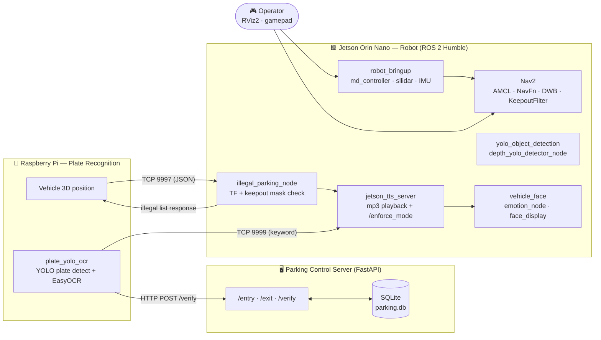

| Node | Role | Communication |
|------|------|---------------|
| **Jetson Orin Nano** | The full ROS 2 stack (driving, SLAM, Nav2, YOLO, face, TTS) | DDS; TCP servers on 9997 / 9999 |
| **Raspberry Pi** | Plate YOLO + EasyOCR, sends vehicle 3D positions | HTTP → FastAPI, TCP → Jetson |
| **Control PC / server** | Entry/exit registration DB, plate similarity API | FastAPI + SQLite |

---

## 🔩 Hardware

The power system is **split at the battery level**: 24 V for traction, 12 V for compute and
sensors. Traction current reaches only the motor driver, through the PDB, while the LiDAR, IMU,
and cameras all feed the Jetson Orin Nano. Because the voltage sag from motor startup never
reaches the compute side, sensor streams survive hard acceleration and braking.

<div align="center">
  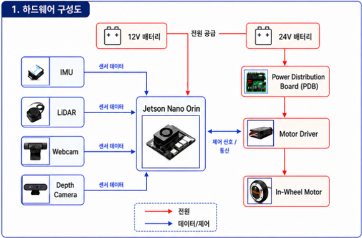
</div>

<sub>Note: the diagram shows the webcam wired directly to the Jetson, but the plate-recognition code
(<code>external/car_license_plate/</code>) is written to run on the Raspberry Pi. Where the camera is
attached may differ between deployments.</sub>

| Category | Device | Interface | Package |
|----------|--------|-----------|---------|
| Compute | **NVIDIA Jetson Orin Nano** | — | Full ROS 2 stack |
| Power | **24 V battery** (traction) + **12 V battery** (compute/sensors), distributed via PDB | — | — |
| Motor driver | **MDROBOT dual-channel driver** (md200t) | RS485 / USB, 19200 bps | `md_controller` |
| Wheels | **MDROBOT in-wheel motors** ×2 (radius 65 mm, track 288 mm) + rear caster | — | URDF `two_wheel_caster_robot` |
| LiDAR | **Slamtec RPLIDAR C1** (mounted on a dedicated pole) | USB CP2102N, 460800 bps | `sllidar_ros2` |
| IMU | **WIT WT901C** | USB, 9600 bps (disabled by default) | `wit_imu_driver` |
| Depth camera | **Orbbec Astra** (640×480 @ 10 fps, mounted under the monitor) | USB, OrbbecSDK / OpenNI | `orbbec_camera` |
| Webcam | USB webcam for plate recognition | USB | `car_license_plate` |
| Display | Front-facing monitor (four glowing expressions) | HDMI + pygame | `vehicle_face` |
| Aux display | 7-inch touchscreen (Raspberry Pi side) | HDMI / DSI | — |
| Audio | USB speaker (played with `mpg123`) | ALSA / PulseAudio | `jetson_tts_server.py` |
| Controller | XInput gamepad (`sudo modprobe xpad`) | USB | `joystick_teleop` |

**Dimensions** — body `0.56 × 0.50 × 0.26 m`, ground to `base_link` 0.26 m, LiDAR height 0.47 m,
Nav2 footprint `[[0.28, 0.25], [0.28, -0.25], [-0.28, -0.25], [-0.28, 0.25]]`

**Chassis** — an aluminium-profile frame with acrylic/PC panels. The top plate is transparent, so the
internal wiring, PDB, and motor driver are all visible; the front panel carries the OMZ mascot logo
and the side carries a `CCTV in Operation` notice sticker.

---

## 📸 Photos & Reference Material

### The Robot

| | | |
|:---:|:---:|:---:|
| 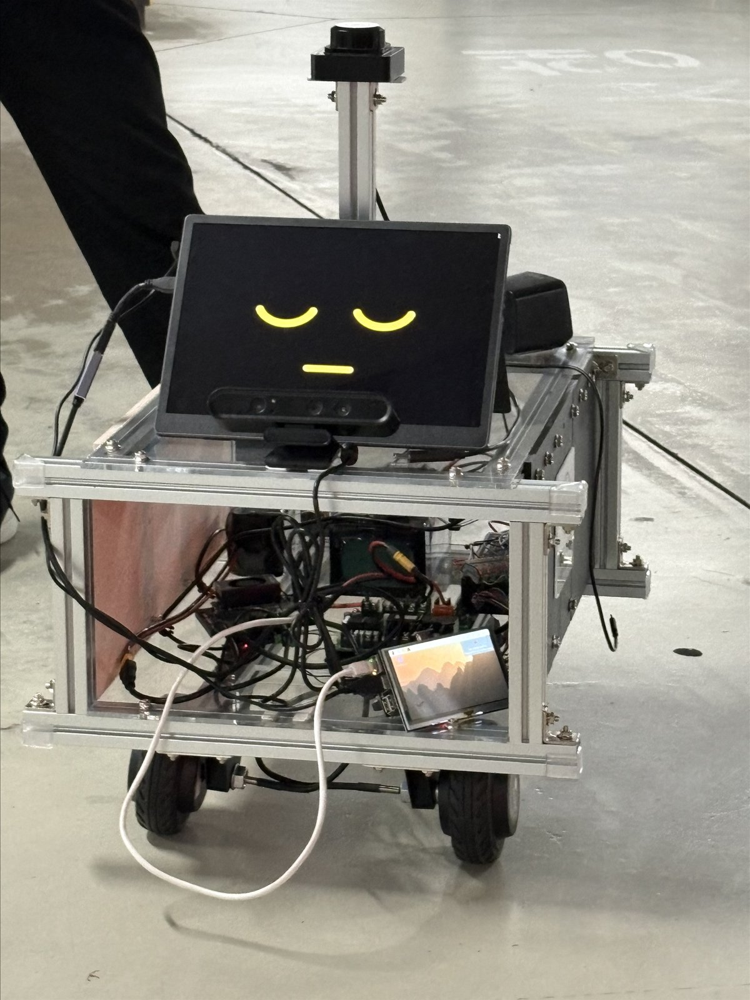 | 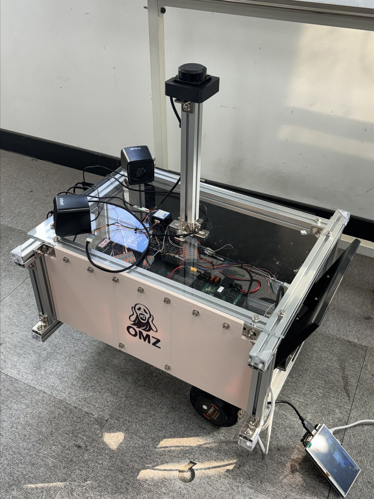 | 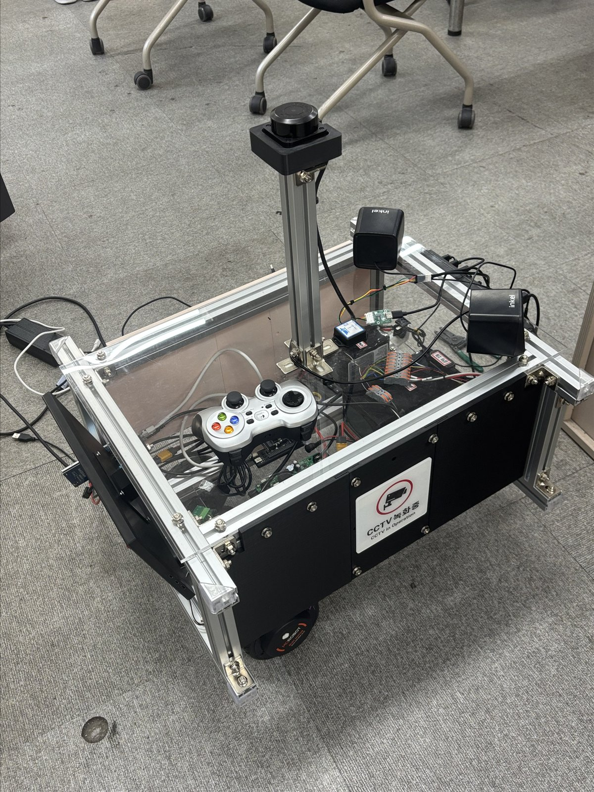 |
| **Front**<br/>Face display · Astra depth camera · RPLIDAR on top | **Overview**<br/>Profile chassis · OMZ logo · in-wheel motor | **Top**<br/>Internal wiring · gamepad · CCTV notice |

### The Four Expressions

These match the `COLORS` definition in `face_display.py`. States switch via the `/emotion_state`
topic, and keys `1`–`4` drive them manually for testing.

| | | | |
|---|---|---|---|
| 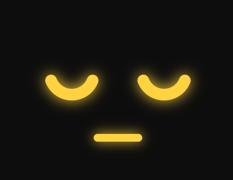 | 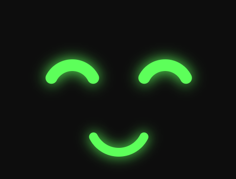 | 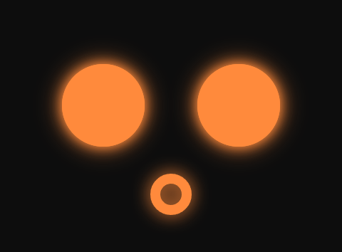 | 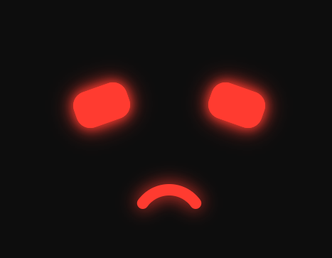 |
| **`stop`** · stopped | **`driving`** · driving | **`obstacle`** · obstacle | **`enforce`** · enforcing |
| `rgb(255, 210, 63)` | `rgb(93, 255, 90)` | `rgb(255, 138, 60)` | `rgb(255, 59, 48)` |
| Downward crescent eyes<br/>+ short flat mouth (calm) | Upward crescent eyes `^^`<br/>+ wide smile (lively) | Large round eyes<br/>+ small `o` mouth (surprise) | Slanted frowning eyes<br/>+ downturned mouth (alert) |
| Key `1` | Key `2` | Key `3` | Key `4` |

pygame has no built-in glow, so the effect is faked by redrawing the same shape several times,
blending it a step further toward the background colour each pass
(`glow_circle` · `glow_arc` · `glow_round_rect`).

---

## 🧭 TF Tree & Frames

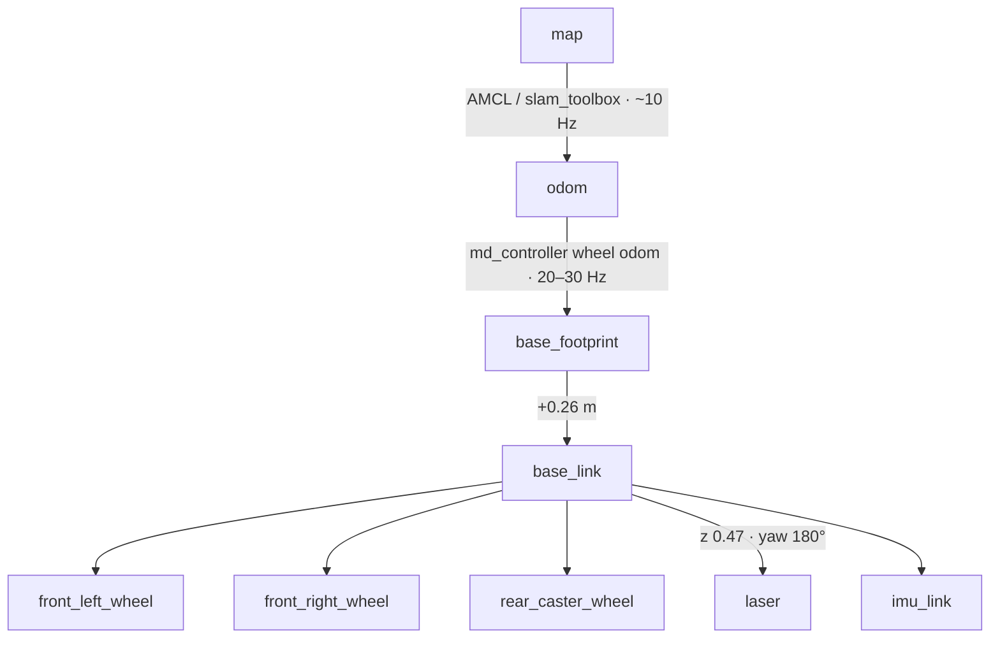

- Frame convention: `x+` forward, `y+` left, `z+` up
- The RPLIDAR C1 reports its 0° direction **opposite** to the robot's front, so the URDF applies a
  `yaw = π` rotation to the laser frame.
- `odom → base_footprint` is published from **wheel odometry alone** (`odom_encoder_ppr:=55`).
  A robot_localization config exists in `config/ekf.yaml`, but **it is not currently run.**

---

## 📁 Repository Layout

```text
omz_ws/
├── src/                              # ROS 2 packages
│   ├── my_robot_description/         # ⭐ URDF · launch · Nav2/SLAM config · maps · utility scripts
│   ├── yolo_object_detection/        # ⭐ YOLOv8 + depth distance estimation
│   ├── vehicle_face/                 # ⭐ Vehicle face display (pygame)
│   ├── joystick_teleop/              # ⭐ Gamepad teleop with a deadman switch
│   ├── illegal_parking_detector/     # ⭐ ROS 2 wrapper for the illegal-parking node
│   ├── md_motor_driver_ros2/         # MD motor driver (md_controller · md_teleop · serial)
│   ├── sllidar_ros2/                 # RPLIDAR driver
│   ├── ros_wit_imu_node/             # WIT IMU driver
│   ├── OrbbecSDK_ROS2/               # Orbbec camera driver
│   └── turtlebot3*/ · DynamixelSDK/  # Vendor packages kept for teleop_keyboard etc.
├── apps/
│   └── car_number_db/                # 🅿️ FastAPI parking server + entry/exit camera clients
├── external/
│   ├── car_license_plate/            # Raspberry Pi plate recognition · original illegal-parking node
│   ├── depth_camera/                 # jetson_tts_server.py · warning mp3s · Astra SDK
│   └── map_keepoutfilter/            # Keepout mask artefacts and integration guide
├── tools/
│   ├── omz_new_launch.sh             # bringup → wait for topics/TF → start Nav2 (`new` alias)
│   ├── lidar_scan_viewer.py          # Live LaserScan view in a browser
│   ├── yaw_compare.py                # Wheel-odom yaw vs IMU yaw
│   └── run_rviz_lidar.sh             # Launch RViz on the Jetson desktop
├── docs/
│   ├── images/                       # 📸 Photos · hardware diagram · expression captures
│   ├── generated/                    # TF frame graph · edited maps
│   └── manuals/                      # MD driver manual
└── robot_run_commands.md             # Cheat sheet of frequently used on-robot commands
```

> ⭐ = written for this project

---

## 📦 Package Catalog

### In-house Packages

<details open>
<summary><b>my_robot_description</b> — the core of the description and driving stack</summary>

<br/>

| File | Purpose |
|------|---------|
| `urdf/two_wheel_caster_robot.urdf` | Differential two-wheel + caster model with LiDAR/IMU mounts |
| `launch/robot_bringup.launch.py` | Unified bringup; motor, LiDAR, IMU, and camera toggle via arguments |
| `launch/nav2_slam.launch.py` | Waits for TF (10 s by default), then starts slam_toolbox |
| `launch/nav2_navigation.launch.py` | Three KeepoutFilter nodes + Nav2 bringup + RViz + waypoint node |
| `launch/save_current_map.launch.py` | Timestamps the previous map into `maps/old/`, then saves a new one |
| `config/nav2_params.yaml` | Nav2 tuning for a slow real robot (631 lines, commented) |
| `behavior_trees/*.xml` | Custom BTs with **spin and backup recovery removed** |
| `scripts/rviz_waypoint_goal.py` | Collects RViz `Publish Point` clicks as waypoints, previews the path, then sends it |
| `scripts/q_emergency_stop.py` | Press `q` to continuously publish a zero `/cmd_vel` |
| `scripts/scan_visual_filter.py` | Publishes `/scan_visual` with near-max-range noise removed |
| `scripts/odom_drive_test.py` | 1 m straight-line wheel-odometry calibration test |
| `scripts/paint_keepout_rect.py` | Paints rectangular regions directly into the keepout mask |

</details>

<details>
<summary><b>yolo_object_detection</b> — person/vehicle detection with distance</summary>

<br/>

- `yolo_detector_node` — RGB image → `/yolo/detections` (JSON), `/yolo/image`
- `depth_yolo_detector_node` — samples a **7×7 depth window** around each box centre to attach
  `depth_m`, then reconstructs 3D coordinates from the camera intrinsics and publishes
  `/yolo_depth/markers` (RViz `MarkerArray`)
- Detected classes: `person` (COCO 0) and `vehicle` (car, motorcycle, bus, truck), separated by a
  `category` field
- Four launch files: `yolo_detector` / `orbbec_yolo` / `orbbec_depth_yolo` / `astra_openni_depth_yolo`
- On a headless robot, pass `show_preview:=false`

</details>

<details>
<summary><b>vehicle_face</b> — emotional display for the vehicle</summary>

<br/>

- `emotion_node` — combines `/cmd_vel`, `/scan`, and `/enforce_mode` to publish `/emotion_state` at ~3 Hz
  - Priority: `enforce` → `obstacle` → `driving` → `stop`
  - Hysteresis on the forward 60° minimum range (**enter at 1.0 m, clear at 2.2 m**) prevents flicker
  - The `enforce` state clears itself after 10 seconds
- `face_display` — pygame glow window that switches colour, eyes, and mouth per state
  (keys `1`–`4` to switch manually, `ESC` to quit)
  → [preview the four expressions](#-photos--reference-material)

</details>

<details>
<summary><b>joystick_teleop</b> — manual driving with safety interlocks</summary>

<br/>

- Publishes `/cmd_vel` **only while the deadman button (RB) is held**; releasing it immediately sends zero
- `B` is an emergency stop; `Y`/`A` adjust forward and reverse speed **independently** in 0.01 m/s steps
- Limits: `max_lin_vel 0.09 m/s`, `max_ang_vel 0.12 rad/s`

</details>

<details>
<summary><b>illegal_parking_detector</b> — wrapper for the illegal-parking node</summary>

<br/>

A thin package that loads `external/car_license_plate/illegal_parking_node.py` through `importlib`
and exposes it as a ROS 2 executable.

```bash
ros2 launch illegal_parking_detector illegal_parking.launch.py
```

</details>

### Parking Control Server — `apps/car_number_db`

| Endpoint | Description |
|----------|-------------|
| `POST /entry` | Register an entry (upsert on `plate` → `status='parked'`) |
| `POST /exit/{plate}` | Mark an exit (`status='exited'`) |
| `POST /verify` | Compare an OCR string against currently parked plates; **threshold 0.80** |
| `GET /docs` | FastAPI auto-generated documentation |

`matcher.py` returns up to five candidates with scores, and every read is logged to the
`plate_read_log` table.

### External & Vendor Packages

| Package | Source |
|---------|--------|
| `md_motor_driver_ros2` | [Lee-seokgwon/md_motor_driver_ros2](https://github.com/Lee-seokgwon/md_motor_driver_ros2) |
| `sllidar_ros2` | [Slamtec/sllidar_ros2](https://github.com/Slamtec/sllidar_ros2) |
| `ros_wit_imu_node` | [Ericsii/ros_wit_imu_node](https://github.com/Ericsii/ros_wit_imu_node) |
| `OrbbecSDK_ROS2` | [orbbec/OrbbecSDK_ROS2](https://github.com/orbbec/OrbbecSDK_ROS2) (`v2-main`) |
| `turtlebot3`, `turtlebot3_msgs`, `turtlebot3_simulations`, `DynamixelSDK` | ROBOTIS (teleop and simulation reference) |

---

## 🚀 Quick Start

### 1. Requirements

Ubuntu 22.04 with **ROS 2 Humble**

```bash
sudo apt install ros-humble-navigation2 ros-humble-nav2-bringup \
                 ros-humble-slam-toolbox ros-humble-robot-localization \
                 ros-humble-joy ros-humble-rviz2 mpg123
python3 -m pip install ultralytics pygame
```

### 2. Clone & Build

```bash
git clone https://github.com/OMZcapstone/omz_ws.git ~/omz_ws
cd ~/omz_ws
source /opt/ros/humble/setup.bash
colcon build --symlink-install
source install/setup.bash
```

### 3. Hardware Preparation

```bash
sudo modprobe xpad            # gamepad
ls -l /dev/serial/by-id/      # confirm motor / LiDAR / IMU ports
```

> ⚠️ The serial-port defaults in `robot_bringup.launch.py` are hard-coded to the **`by-path` paths of
> the development Jetson**. On any other machine, override them with `motor_port:=`, `lidar_port:=`,
> and `imu_port:=`. The YOLO weights (`yolov8n.pt`) and the plate model (`best.pt`) are excluded by
> `.gitignore` and **must be supplied separately**.

---

## 🎬 Run Scenarios

### ① Bring the robot up

```bash
ros2 launch my_robot_description robot_bringup.launch.py
```

| Argument | Default | Description |
|----------|---------|-------------|
| `use_motor` / `use_lidar` | `true` | Start the motor and LiDAR |
| `use_imu` / `use_camera` | `false` | IMU and Orbbec camera (enable when needed) |
| `odom_encoder_ppr` | `55` | **The key wheel-odometry calibration value** |
| `motor_cmd_scale` | `10.0` | Final scale applied to wheel RPM commands |
| `left_motor_cmd_scale` / `right_motor_cmd_scale` | `1.00` | Trim for left/right drift when driving straight |
| `angular_cmd_scale` | `0.6` | Damping on rotation commands |
| `publish_odom_tf` | `true` | Publish the `odom → base_footprint` TF |

### ② Bringup + Nav2 in one step (recommended)

`tools/omz_new_launch.sh` kills leftover processes, starts bringup, waits for `/odom`, `/scan`, and
the `odom→base_footprint` TF, and only then launches Nav2.

```bash
new            # start (= tools/omz_new_launch.sh start)
newstatus      # process and node list
newlogs        # log directory path (~/.ros/omz_new)
newstop        # stop everything
```

### ③ Build a map with SLAM, then save it

```bash
ros2 launch my_robot_description nav2_slam.launch.py     # then drive manually to build the map
ros2 launch my_robot_description save_current_map.launch.py
# → src/my_robot_description/maps/current/omz_map.{yaml,pgm}
#   the previous map is timestamped into maps/old/
```

### ④ Autonomous navigation

```bash
ros2 launch my_robot_description nav2_navigation.launch.py
```

Set the initial pose in RViz with **2D Pose Estimate**, then click `Publish Point` several times to
stack waypoints and send the route with **2D Goal Pose**. The `rviz_waypoint_goal` node draws a
preview of the resulting path.

### ⑤ Manual driving

```bash
ros2 launch joystick_teleop joystick_teleop.launch.py    # gamepad (hold RB)
ros2 run turtlebot3_teleop teleop_keyboard               # keyboard
ros2 run my_robot_description q_emergency_stop           # q = emergency stop
```

### ⑥ Camera + YOLO

```bash
ros2 launch yolo_object_detection orbbec_yolo.launch.py                     # RGB
ros2 launch yolo_object_detection orbbec_depth_yolo.launch.py               # RGB + distance
ros2 launch yolo_object_detection orbbec_depth_yolo.launch.py show_preview:=false
```

### ⑦ Face & voice

```bash
face                                      # face window + automatic expression node (shell alias)
ros2 run vehicle_face face_display        # run from the terminal attached to the monitor
ros2 run vehicle_face emotion_node
ros2 topic pub /emotion_state std_msgs/String "data: driving"   # manual test

say                                       # select the USB speaker + start the TTS server (shell alias)
python3 ~/omz_ws/external/depth_camera/jetson_tts_server.py
```

### ⑧ Parking control server

```bash
cd apps/car_number_db
pip install fastapi uvicorn opencv-python easyocr requests
uvicorn app:app --reload        # http://127.0.0.1:8000/docs
python camera_entry.py          # entry gate camera
python camera_exit.py           # exit gate camera
```

---

## 🚨 Illegal Parking Pipeline

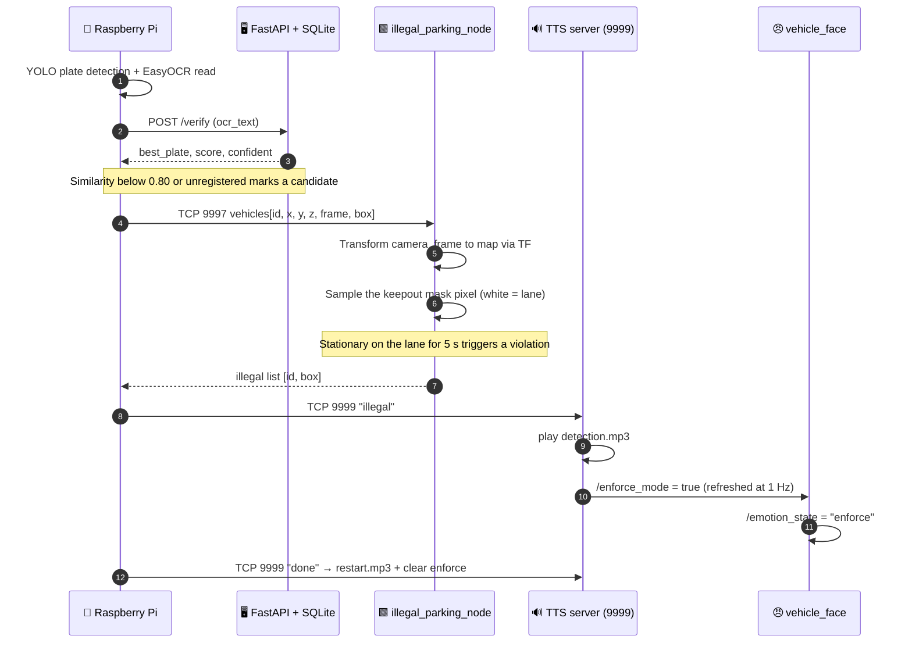

| Keyword received | Audio played | Effect |
|------------------|--------------|--------|
| `사람` / `차량` / `물체` (person / vehicle / object) | `warning.mp3` | Proximity warning (skipped while enforcing) |
| `불법` (illegal) | `detection.mp3` | `/enforce_mode = true` |
| `완료` (done) | `restart.mp3` | `/enforce_mode = false` |

---

## 🔌 Topic Interfaces

| Topic | Type | Published by | Subscribed by |
|-------|------|--------------|---------------|
| `/cmd_vel` | `geometry_msgs/Twist` | Nav2, teleop, emergency stop | `md_controller`, `emotion_node` |
| `/odom` | `nav_msgs/Odometry` | `md_controller` | Nav2, `yaw_compare` |
| `/joint_states` | `sensor_msgs/JointState` | `md_controller` | `robot_state_publisher` |
| `/md/motor_feedback` | `std_msgs/Int32MultiArray` | `md_controller` | Diagnostics |
| `/scan` | `sensor_msgs/LaserScan` | `sllidar_node` | Nav2, slam_toolbox, `emotion_node` |
| `/scan_visual` | `sensor_msgs/LaserScan` | `scan_visual_filter` | RViz visualisation |
| `/camera/color/image_raw`, `/camera/depth/image_raw` | `sensor_msgs/Image` | `orbbec_camera` | YOLO nodes |
| `/yolo/detections`, `/yolo_depth/detections` | `std_msgs/String` (JSON) | YOLO nodes | External consumers |
| `/yolo_depth/markers` | `visualization_msgs/MarkerArray` | `depth_yolo_detector_node` | RViz |
| `/clicked_point` | `geometry_msgs/PointStamped` | RViz | `rviz_waypoint_goal` |
| `/waypoint_global_plan`, `/waypoint_markers` | `nav_msgs/Path`, `MarkerArray` | `rviz_waypoint_goal` | RViz |
| `/emotion_state` | `std_msgs/String` | `emotion_node` | `face_display` |
| `/enforce_mode` | `std_msgs/Bool` | TTS server | `emotion_node` |
| `/costmap_filter_info`, `/keepout_filter_mask` | Nav2 filter | Two map_server nodes | Global and local costmaps |

**Actions used** — `/navigate_to_pose`, `/navigate_through_poses`, `/compute_path_to_pose`, `/compute_path_through_poses`

---

## ⚙️ Nav2 Tuning Summary

`config/nav2_params.yaml` is aimed at two problems seen on the real robot at low speed: creeping in
tiny increments, and a persistent drift to the right.

| Item | Value | Rationale |
|------|-------|-----------|
| Planner | `NavfnPlanner` (GridBased), replanned at 0.5 Hz | Keeps the path from jittering at low speed |
| Controller | `DWBLocalPlanner` @ 10 Hz | Prevents visible gaps in control updates |
| `max_vel_x` / `max_speed_xy` | **0.05 m/s** | Keeps AMCL matching stable |
| `max_vel_theta` | 0.15 rad/s | Leaves room to follow the global path heading |
| velocity_smoother | `[0.06, 0.0, 0.08]`, min x = 0 | Blocks reverse commands during autonomous driving |
| Costmap resolution / inflation | 0.05 m / 0.30 m | Inflation larger than the footprint's inscribed radius |
| Localization | AMCL `DifferentialMotionModel` | Differential-drive motion model |
| Behavior tree | `navigate_*_no_spin.xml` | **Spin and backup recovery removed**; on failure, clear the local costmap and wait 2 s, up to twice |
| Costmap filter | `KeepoutFilter` (global + local) | Blocks entry outside the mask |

---

## 🗺️ Map & Keepout Mask

The navigation map is produced in three stages: **floor plan → SLAM occupancy grid → keepout mask**.

<div align="center">
  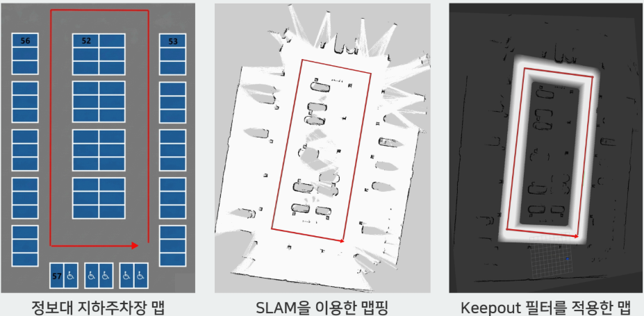
</div>

| Stage | Description |
|-------|-------------|
| **① Underground parking floor plan** | Blue cells are parking bays, organised into zones `52`, `53`, `56`, `57` plus accessible bays at the bottom. The red arrow is the **patrol route**, a single loop around the central island. |
| **② SLAM mapping** | The occupancy grid built by `slam_toolbox`. Walls and pillars are recorded — and so are **the cars parked there at the time**; the bay markings from the floor plan do not survive. |
| **③ Keepout filter applied** | The bright band is the drivable lane; everything darker is a **no-entry zone**. |

### Why the Keepout Filter Is Needed

Running Nav2 on the SLAM map alone lets the planner **route straight through empty parking bays** —
on the grid they are simply free space. In reality cars move in and out of those bays constantly and
the patrol robot must stay out. The keepout mask allows only the lane, so the planner will not path
through a bay even when nothing is parked in it.

The lane boundary in ③ fades out rather than cutting off sharply because the mask YAML uses
`mode: scale`. Instead of a binary block, the mask contributes a **graduated cost** proportional to
brightness, so cost rises gently toward the lane edges. The planner therefore hugs the lane centre
rather than the walls — which is exactly what `centerline_bias` in the mask filename refers to.

`nav2_navigation.launch.py` brings up three nodes to apply it.

| Node | Role |
|------|------|
| `map_server` (`keepout_filter_mask_server`) | Publishes the mask PGM on `/keepout_filter_mask` |
| `costmap_filter_info_server` | Publishes `type: 0` (KeepoutFilter), `base: 0.0`, `multiplier: 1.0` on `/costmap_filter_info` |
| `lifecycle_manager_keepout_filter` | Automatically brings up the two nodes above |

In `nav2_params.yaml`, the `KeepoutFilter` plugin is registered on **both the global and local
costmaps**, so the same constraint applies to global planning and local avoidance alike.

### Map Files

| File | Purpose |
|------|---------|
| `maps/current/om_map_original_cleaned.{yaml,pgm}` | **Default Nav2 map** (resolution 0.05, origin `-22.6, -8.12`) |
| `maps/current/keepout_mask_full_centerline_bias.{yaml,pgm}` | Drivable-lane mask (**white = lane**) |
| `maps/current/omz_map.*` | Most recent slam_toolbox save |
| `maps/old/` | Timestamped backups |
| `external/map_keepoutfilter/` | Mask generation artefacts and `nav2_params` integration guide |

The same mask is **reused for illegal-parking detection**. `illegal_parking_node` converts a
vehicle's map coordinates into mask pixels; if the pixel is white (lane) the vehicle is considered to
be occupying the lane, and holding that for five seconds triggers a violation.

```bash
ros2 run my_robot_description paint_keepout_rect   # edit rectangular regions of the mask
```

---

## 🔧 Troubleshooting

<details>
<summary><b>The robot drifts to one side instead of driving straight</b></summary>

<br/>

Trim with `left_motor_cmd_scale` / `right_motor_cmd_scale`. If it drifts right, lower
`left_motor_cmd_scale`.

```bash
ros2 launch my_robot_description robot_bringup.launch.py left_motor_cmd_scale:=0.97
```

</details>

<details>
<summary><b>Odometry distance does not match reality</b></summary>

<br/>

Adjust `odom_encoder_ppr`, then verify with a 1 m straight-line test.

```bash
ros2 run my_robot_description odom_drive_test --ros-args \
  -p speed:=0.05 -p target_distance:=1.0 -p duration:=20.0
```

</details>

<details>
<summary><b>SLAM / Nav2 cannot find TF</b></summary>

<br/>

`nav2_slam.launch.py` waits 10 s (`slam_start_delay`) before starting. The `new` script checks
`/odom`, `/scan`, and TF before bringing up Nav2, which avoids startup-ordering problems entirely.

</details>

<details>
<summary><b>RViz will not open (over SSH)</b></summary>

<br/>

Pass `display:=` and `xauthority:=` to `nav2_navigation.launch.py`, or run
`tools/run_rviz_lidar.sh` from the Jetson desktop. On a headless robot, use `use_rviz:=false`.

</details>

<details>
<summary><b>Quickly inspecting LiDAR and odometry</b></summary>

<br/>

```bash
python3 tools/lidar_scan_viewer.py     # live scan view in a browser
python3 tools/yaw_compare.py           # wheel-odom yaw vs IMU yaw
```

</details>

---

## ⚠️ Known Limitations

- **Hard-coded absolute paths** — `/home/omz/omz_ws/...` still appears in `nav2_params.yaml`,
  `illegal_parking_node.py`, `save_current_map.launch.py`, and elsewhere; other accounts or paths
  require edits.
- **Submodules committed as flat files** — `external/depth_camera/.gitmodules` preserves the original
  URLs, but the contents are committed as ordinary files. `src/lingbot-map` is declared with no content.
- **Windows checkout** — Astra SDK paths exceed 260 characters, so `git config core.longpaths true`
  is required.
- **Model weights not included** — `.pt` files are excluded by `.gitignore`.
- **EKF unused** — `config/ekf.yaml` is prepared but not run; driving relies on wheel odometry alone.
- **OCR accuracy** — misreads such as `154러 → 154리` occur; registering only reads above 0.8
  confidence has been proposed as an improvement.
- **Unauthenticated TCP servers** — ports 9997 and 9999 are plaintext and unauthenticated, so they
  assume an isolated network.

---

## 📄 License

The in-house packages are **Apache-2.0** (`vehicle_face` is **MIT**). The vendor packages under
`src/` (DynamixelSDK, turtlebot3, sllidar_ros2, OrbbecSDK_ROS2, md_motor_driver_ros2,
ros_wit_imu_node) and the SDKs under `external/` remain under their original licenses.

### Credits

- MD motor driver ROS 2 port — [c-jho](https://github.com/c-jho), [Lee-seokgwon](https://github.com/Lee-seokgwon)
- The Nav2, slam_toolbox, Ultralytics YOLO, and EasyOCR open-source communities

<div align="center">

**OMZ Capstone** · ROS 2 Humble

</div>
